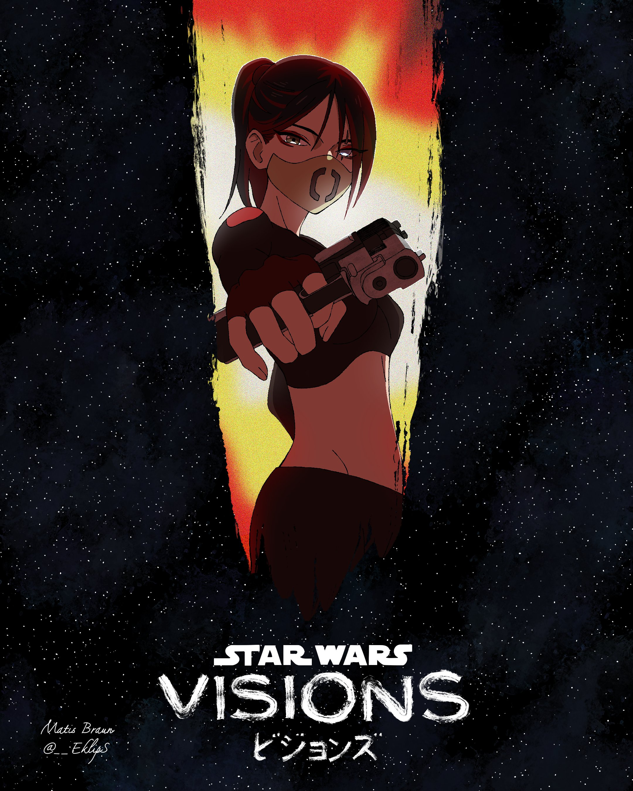
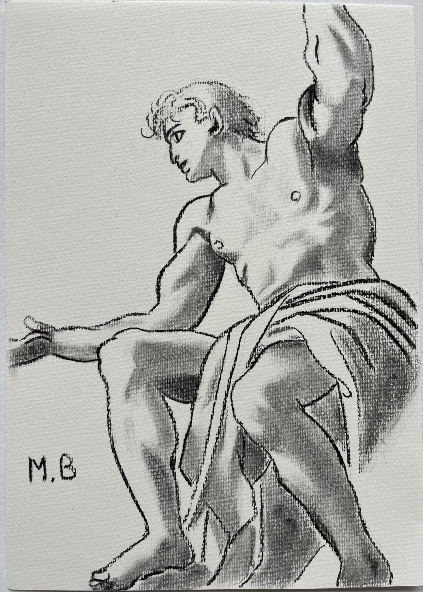
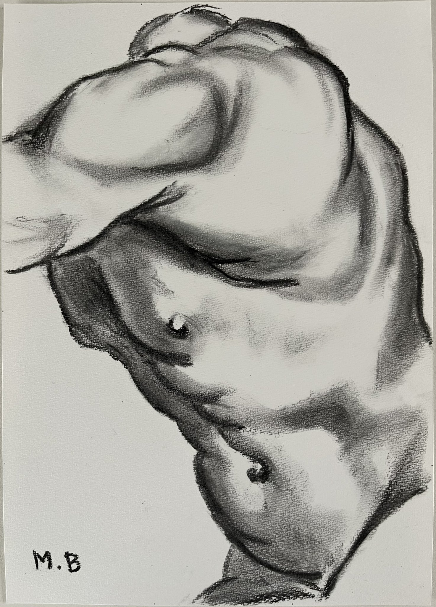
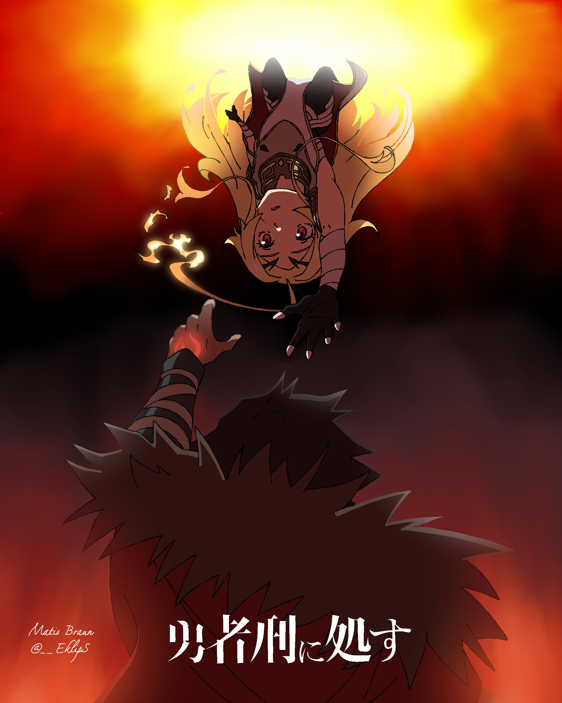
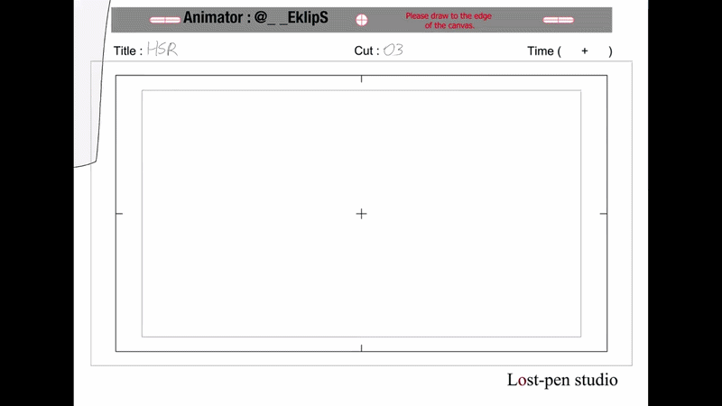

<h1 align="center">👋 Hello ! I'm Matis Braun</h1>

$\color{gray}{\textit{The Tale of the Princess Kaguya, charcoal and watercolor animation, Ghibli}}$
 
$\color{gray}{\textit{Animator : Shinji Hashimoto}}$

 

## Matis Braun

### Mathematics | Artificial Intelligence | Data Science | 2D Animation 

 

 

Passionate and curious from an early age about mathematics, science, space, and art, I became fascinated by artificial intelligence in 2013, when I first came across the term in [Le Monde's special "Futur : Les avancées technologiques"](https://www.noosfere.org/livres/niourf.asp?numlivre=2146585029). Since then, I have been following the field’s progress closely, and my fascination gradually turned into a clear ambition to make my career in Artificial Intelligence.

Today, I am an AI scientist, having graduated from EPITA in 2026 with a Master’s degree in Computer Science and a specialization in Artificial Intelligence and Computer Vision. I am now working toward my next goal : pursuing a PhD in Computer Vision, with a focus on satellite and space imagery.

Alongside science and technology, creativity has always been an important part of who I am. I have been drawing and making art since childhood, and my early discovery of Studio Ghibli films, with their sense of wonder, imagination, and creative freedom, inspired me to explore 2D animation and visual storytelling.

Today, I also work as a professional 2D animator in my free time. I've had the opportunity to draw and animate for major Japanese animation studios such as MAPPA, A-1 Pictures, Wit Studio, ... , contributing to productions including Star Wars : Visions for Disney, Jujutsu Kaisen, Solo Leveling, ... and other projects that have not yet been released. You can find the full list of productions I've worked on [here](https://keyframe-staff-list.com/person/331579).

 

<h3>&nbsp;IA Projects</h3>
 
| Project | Description | Stack |
| :--- | :--- | :--- |
| 🕹️ **[RL Project](https://github.com/VyrtualL/RL-Project)** | An implementation of a Dueling Double Q Learning + Noisy Network on the Atari game : Pong | `PyTorch` `Gymnasium` |
| 💾 **[MLP From Scratch](https://github.com/VyrtualL/IA_Image_Recognition)** | Developed a digit recognition MLP for MNIST from scratch in C | `C` |
| 🪟 **[Swin Transformer](https://github.com/VyrtualL/Swin-Transformer)** | Reimplementation of the paper Swin Transformer from Microsoft | `Python` `PyTorch` |
| 🧩 **[Deep Learning Projects](https://github.com/VyrtualL/MLProjects)** | Reimplementation of Open-Set R-CNN, VAE on MNIST, Super Resolution (EDSR),… | `Python` |
| 🤖 **[GPGPU](https://github.com/VyrtualL/GPGPU)** | Video Motion Estimation project using GPGPU techniques in Cuda and C++ | `Cuda` `C++` `C`|
| 🎞️ **[Video Processing](https://github.com/VyrtualL/VideoProcessing)** | Implementation of mesh-based motion estimation using gradient descent, implementation of block-based motion vector estimation,… | `Python` `NumPy` |
| 🎯 **[MLVOT](https://github.com/VyrtualL/MLVOT-MatisBraun)** | Multi-object tracking using Kalman Filters | `Python` |
| 🔍 **[Differentiable Prog](https://github.com/VyrtualL/Prog_Differentiable)** | A differentiable programming project implementing a reverse-mode autograd engine from scratch, then using it to build and compare gradient-based optimizers, learning-rate schedulers, and small neural networks. | `Python` |
| 🐈 **[MLOps](https://github.com/VyrtualL/ML_OPS)** | Reproduction of ChatGPT (Front interface, MLFlow, Canary deployment, API, Kafka stream, User hierarchy,…) | `Python` `Docker` `Apache Kafka` |
| 🧬 **[MLBio](https://github.com/VyrtualL/MLBIO)** | ML in Biomedical : ECG Classifi cation, Cell Segmentation, Solubility Prediction, Federated Learning Local,…  | `Python` `Scikit-Learn` `RDKit` |
 

 

<h2>🎨&nbsp;Drawing</h2>
 
I'm a big charcoal drawing enthusiast ! Here are some of my charcoal drawings, as well as a few of the drawings I made for my participation to somes animes productions.
 

  
  
  
  

 

<h2>🎬&nbsp;Some Clips From My Animation Works for Japanese Studios</h2>
 
<table>
  <tr>
    <td align="center">
       
      <em>Wit / Disney — Star Wars Vision</em>
    </td>
    <td align="center">
       
      <em>MAPPA — Jujutsu Kaisen Season 2</em>
    </td>
    <td align="center">
       
      <em>A1-Pictures — Solo Leveling Season 1 & 2</em>
    </td>
  </tr>
  <tr>
    <td align="center">
       
      <em>Pinejam — Madoka Magica</em>
    </td>
    <td align="center">
       
      <em>Pinejam — Hime-sama Goumon</em>
    </td>
    <td align="center">
       
      <em>Some others works</em>
    </td>
  </tr>
</table>

